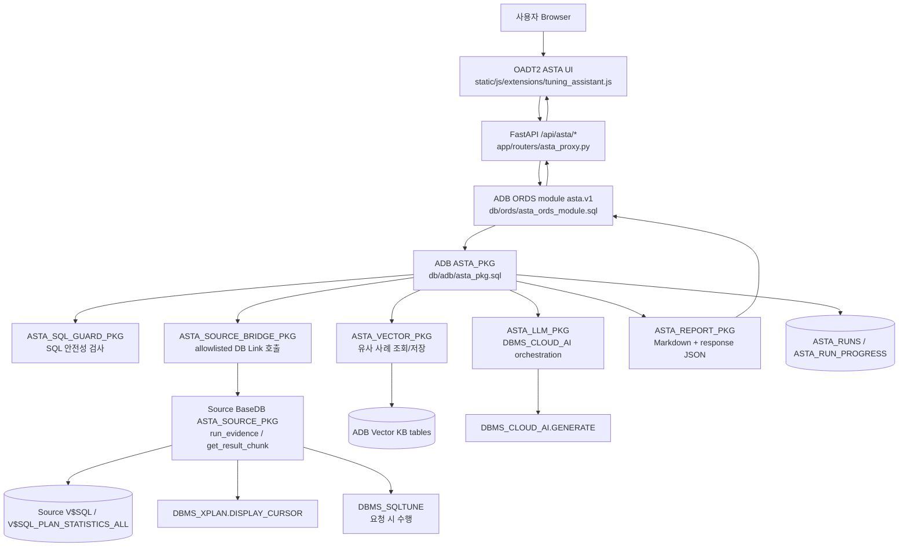
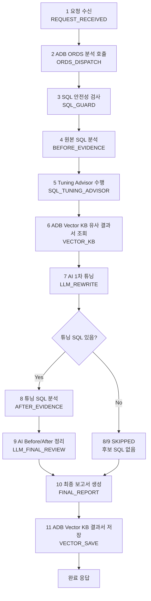
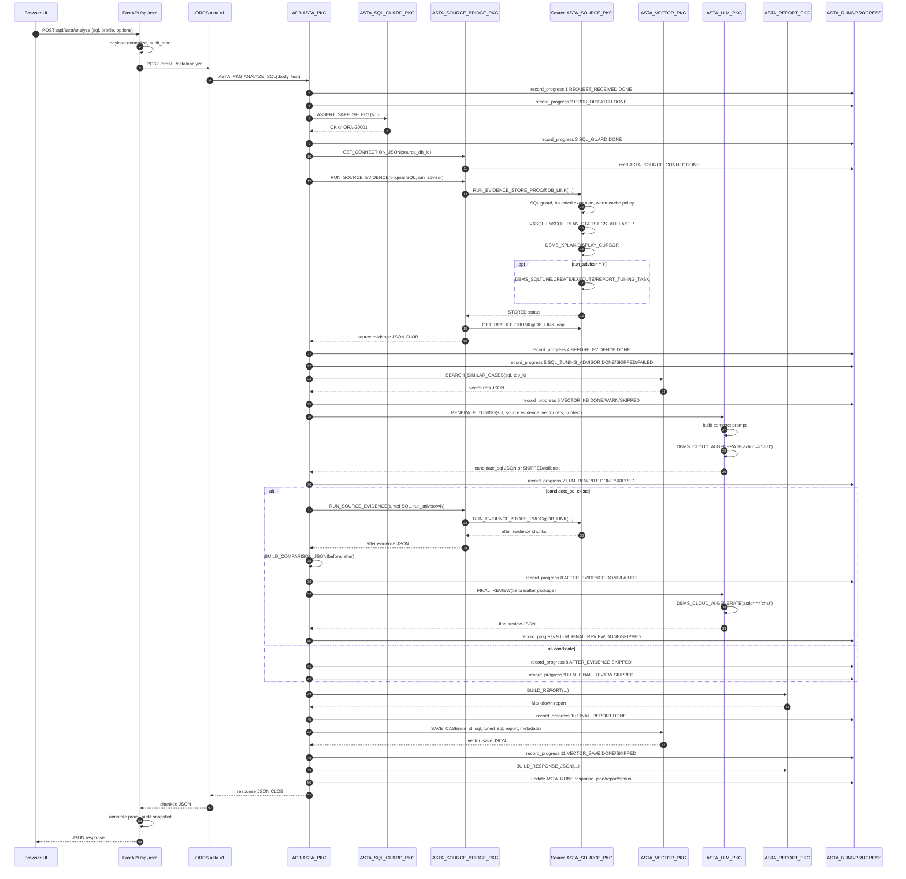

# OADT2 ASTA 내부 아키텍처 및 수행 순서

최종 업데이트: 2026-06-26

이 문서는 OADT2의 **AI SQL Tuning Assistant(ASTA)** 가 내부적으로 어떤 API, ORDS endpoint, ADB PL/SQL package, Source BaseDB procedure를 호출하는지 설명합니다.

## 1. 현재 결론

현재 ASTA의 기준 구조는 **ADB ORDS + PL/SQL 중심**입니다.

```text
OADT2 FastAPI = ORDS_PROXY_ONLY
ADB ORDS/PLSQL = ASTA canonical runtime
Source BaseDB = SQL 실행 evidence helper
```

금지 사항:

```text
- FastAPI/Python에서 Source DB 직접 접속 금지
- SSH tunnel/source direct fallback 금지
- Python subprocess로 XPLAN/SQLTUNE 수집 금지
- Python에서 Vector/LLM/report canonical 생성 금지
```

허용 사항:

```text
- FastAPI same-origin proxy
- ORDS JSON pass-through
- profile 목록 필터링
- run/progress/report lookup proxy
- audit snapshot 보조 저장
```

## 2. 전체 구성도



## 3. HTTP/API 계층

### 3.1 Browser → FastAPI

FastAPI endpoint는 `/api/asta/*` 입니다. 브라우저는 ADB ORDS URL을 직접 호출하지 않습니다.

| Method | FastAPI path | 역할 | 내부 호출 |
|---|---|---|---|
| `GET` | `/api/asta/profiles` | ASTA profile 목록 조회 | ORDS `/profiles` |
| `POST` | `/api/asta/analyze` | SQL 튜닝 분석 요청 | ORDS `/analyze` |
| `GET` | `/api/asta/runs/{run_id}` | 저장된 run 전체 JSON 조회 | ORDS `/runs/:run_id` |
| `GET` | `/api/asta/runs/{run_id}/progress` | 수행 이력 조회 | ORDS `/runs/:run_id/progress` |
| `GET` | `/api/asta/runs/{run_id}/report` | Markdown 결과서 조회 | ORDS `/runs/:run_id/report` |

FastAPI 구현 파일:

```text
app/routers/asta_proxy.py
```

주요 함수:

| 함수 | 역할 |
|---|---|
| `_coerce_payload()` | UI payload를 ORDS ASTA contract로 정규화 |
| `_resolve_ords_url()` | DB별 `config.yaml`의 `asta.ords_base_url` + path 계산 |
| `_post_json_to_ords()` | ORDS `POST` 호출 |
| `_get_json_from_ords()` | ORDS `GET` 호출 |
| `profiles()` | `/api/asta/profiles` handler |
| `analyze()` | `/api/asta/analyze` handler |
| `get_run()` | `/api/asta/runs/{run_id}` handler |
| `get_run_progress()` | `/api/asta/runs/{run_id}/progress` handler |
| `get_run_report()` | `/api/asta/runs/{run_id}/report` handler |

FastAPI가 payload에 넣는 주요 기본값:

```json
{
  "source_db_id": "DB0903_TESTDB",
  "fetch_rows": 100,
  "benchmark_repeat": 1,
  "sqltune_time_limit": 1800,
  "vector_top_k": 3,
  "use_llm": true,
  "run_advisor": false,
  "llm_profile": "ASTA_GROK_REASONING_PROFILE"
}
```

`run_advisor`는 기본 `false`입니다. SQL Tuning Advisor를 원하면 UI/API에서 `run_advisor=true` 또는 `use_sqltune=true`로 요청해야 합니다.

### 3.2 FastAPI → ORDS

ORDS module 파일:

```text
db/ords/asta_ords_module.sql
```

ORDS module:

```text
module_name = asta.v1
base_path   = asta/
```

| Method | ORDS pattern | PL/SQL 호출 |
|---|---|---|
| `POST` | `analyze` | `ASTA_PKG.ANALYZE_SQL(:body_text)` |
| `GET` | `profiles` | `ASTA_PKG.LIST_PROFILES` |
| `GET` | `runs/:run_id` | `ASTA_PKG.GET_RUN(:run_id)` |
| `GET` | `runs/:run_id/progress` | `ASTA_PKG.GET_PROGRESS(:run_id)` |
| `GET` | `runs/:run_id/report` | `ASTA_PKG.GET_REPORT(:run_id)` |

모든 ORDS JSON handler는 CLOB를 2000자 chunk로 `HTP.prn` 하며, 다음 header를 내려줍니다.

```text
Content-Type: application/json; charset=utf-8
X-ASTA-Execution-Boundary: ADB_ORDS_PLSQL
X-ASTA-FastAPI-Role: ORDS_PROXY_ONLY
X-ASTA-Source-Runtime: SOURCE_BASEDB_DBLINK_ONLY
X-ASTA-Guard-Policy: SELECT_WITH_SINGLE_STATEMENT
X-ASTA-Api-Version: asta.v1
X-ASTA-Contract-Version: asta.v1
X-ASTA-Response-Mode: CLOB_CHUNKED_JSON
```

## 4. ADB PL/SQL package 구성

### 4.1 Repository DDL

경로:

```text
db/asta/
```

| 파일 | 내용 |
|---|---|
| `001_asta_repository.sql` | `asta_runs`, `asta_run_progress` |
| `002_asta_source_connections.sql` | Source DB allowlist: `asta_source_connections` |
| `003_asta_runs_source_db_id.sql` | 기존 repository migration |
| `004_asta_vector_tables.sql` | Vector KB: `asta_tuning_cases`, `asta_tuning_case_chunks` |

핵심 table:

```text
ASTA_RUNS
  - run_id
  - status
  - input_sql
  - tuned_sql
  - llm_profile
  - source_db_id/source_schema/source_db_link
  - detailed_report_md
  - response_json
  - error_code/error_message

ASTA_RUN_PROGRESS
  - run_id
  - seq
  - code
  - label
  - status
  - detail
  - started_at/completed_at/elapsed_ms

ASTA_SOURCE_CONNECTIONS
  - source_db_id
  - db_link_name
  - source_schema
  - enabled

ASTA_TUNING_CASES / ASTA_TUNING_CASE_CHUNKS
  - 유사 사례 조회/저장용 KB
```

`ASTA_RUN_PROGRESS`는 `PRAGMA AUTONOMOUS_TRANSACTION`으로 즉시 commit됩니다. 초기 progress가 `ASTA_RUNS` insert보다 먼저 기록될 수 있으므로 FK를 두지 않습니다.

### 4.2 ADB package 목록

경로:

```text
db/adb/
```

| Package | 파일 | 역할 |
|---|---|---|
| `ASTA_PKG` | `asta_pkg.sql` | 전체 orchestration, ORDS 공개 API |
| `ASTA_SQL_GUARD_PKG` | `asta_sql_guard_pkg.sql` | SELECT/WITH 단일문 guard, candidate SQL 추출/검증 |
| `ASTA_SOURCE_BRIDGE_PKG` | `asta_source_bridge_pkg.sql` | allowlisted DB Link로 Source helper 호출 |
| `ASTA_VECTOR_PKG` | `asta_vector_pkg.sql` | Vector KB 유사 사례 조회/저장 |
| `ASTA_LLM_PKG` | `asta_llm_pkg.sql` | DBMS_CLOUD_AI 1차 튜닝/최종 리뷰 |
| `ASTA_REPORT_PKG` | `asta_report_pkg.sql` | 사용자 Markdown 결과서와 API response JSON 생성 |

## 5. Source BaseDB helper

파일:

```text
db/source/asta_source_pkg.sql
```

설치 위치:

```text
Source BaseDB
```

ADB는 Source DB에 직접 접속하지 않고 DB Link를 통해 Source helper procedure를 호출합니다.

주요 function/procedure:

| Procedure/Function | 역할 |
|---|---|
| `ASTA_SOURCE_PKG.RUN_EVIDENCE` | Source DB에서 SQL 실행 evidence CLOB JSON 생성 |
| `ASTA_SOURCE_PKG.RUN_EVIDENCE_STORE_VC` | DB Link VARCHAR2 제약을 위한 저장형 wrapper |
| `ASTA_SOURCE_PKG.RUN_EVIDENCE_STORE_PROC` | ADB bridge가 호출하는 OUT VARCHAR2 status wrapper |
| `ASTA_SOURCE_PKG.GET_RESULT_CHUNK` | 저장된 CLOB 결과를 chunk로 반환 |
| `ASTA_SOURCE_PKG.RUN_ADVISOR_JOB` | SQL Tuning Advisor job 수행 보조 |

Source helper가 수집하는 evidence:

```text
- run_id
- sql_id
- child_number
- plan_hash_value
- fetch_rows_limit
- row_count
- elapsed_wall_ms
- last_output_rows
- last_cr_buffer_gets
- last_disk_reads
- last_elapsed_time_us
- plan_text / xplan
- advisor.status / advisor.report
- error JSON
```

중요 metrics 정책:

```sql
SELECT MAX(CASE WHEN id IN (0,1) THEN last_output_rows END) AS last_output_rows,
       MAX(last_cr_buffer_gets)                             AS last_cr_buffer_gets,
       MAX(last_disk_reads)                                 AS last_disk_reads,
       MAX(last_elapsed_time)                               AS last_elapsed_time_us
FROM v$sql_plan_statistics_all
WHERE sql_id = :sql_id
AND   child_number = :child_number;
```

- `V$SQL.BUFFER_GETS` 누적값은 전/후 비교 기준으로 쓰지 않습니다.
- XPLAN Id 0만 보는 방식도 스칼라 서브쿼리/FILTER에서 부정확할 수 있습니다.
- OLTP/짧은 SQL은 elapsed보다 buffer gets/consistent gets 감소를 우선 판단합니다.
- `disk_reads > 0`이면 elapsed는 물리 I/O 영향을 받을 수 있습니다.

## 6. ASTA 분석 수행 순서도

### 6.1 11단계 수행 이력



현재 PL/SQL 내부 기록 순서는 `FINAL_REPORT`가 10, `VECTOR_SAVE`가 11입니다. UI 문구는 사용자 기준 수행 이력 11단계로 정규화해 표시합니다.

### 6.2 상세 sequence diagram



## 7. ASTA_PKG.ANALYZE_SQL 내부 상세 순서

`db/adb/asta_pkg.sql`의 `ASTA_PKG.ANALYZE_SQL` 기준입니다.

| 순서 | Progress code | 내부 호출 | 설명 |
|---:|---|---|---|
| 1 | `REQUEST_RECEIVED` | `record_progress` | 요청 수신 기록. autonomous transaction |
| 2 | `ORDS_DISPATCH` | `record_progress` | ORDS 분석 호출 기록 |
| 3 | `SQL_GUARD` | `ASTA_SQL_GUARD_PKG.ASSERT_SAFE_SELECT` | SELECT/WITH 단일문 확인 |
| 4 | `BEFORE_EVIDENCE` | `ASTA_SOURCE_BRIDGE_PKG.GET_CONNECTION_JSON` | `ASTA_SOURCE_CONNECTIONS` allowlist 조회 |
| 5 | `BEFORE_EVIDENCE` | `ASTA_SOURCE_BRIDGE_PKG.RUN_SOURCE_EVIDENCE` | Source helper via DB Link로 원본 SQL evidence 수집 |
| 6 | `SQL_TUNING_ADVISOR` | Source `ASTA_SOURCE_PKG` 내부 `DBMS_SQLTUNE` | `run_advisor=Y`일 때 수행, 아니면 SKIPPED |
| 7 | `VECTOR_KB` | `ASTA_VECTOR_PKG.SEARCH_SIMILAR_CASES` | 유사 사례 조회 |
| 8 | `LLM_REWRITE` | `ASTA_LLM_PKG.GENERATE_TUNING` | DBMS_CLOUD_AI로 1차 튜닝 SQL 생성 |
| 9 | `AFTER_EVIDENCE` | `ASTA_SOURCE_BRIDGE_PKG.RUN_SOURCE_EVIDENCE` | 튜닝 SQL을 Source helper로 재수행 |
| 10 | `LLM_FINAL_REVIEW` | `ASTA_PKG.BUILD_COMPARISON_JSON`, `ASTA_LLM_PKG.FINAL_REVIEW` | before/after 비교 및 최종 AI 정리 |
| 11 | `FINAL_REPORT` | `ASTA_REPORT_PKG.BUILD_REPORT` | Markdown 결과서 생성 |
| 12 | `VECTOR_SAVE` | `ASTA_VECTOR_PKG.SAVE_CASE` | 결과서/SQL chunks 저장 |
| 13 | response | `ASTA_REPORT_PKG.BUILD_RESPONSE_JSON` | API JSON 생성 후 `ASTA_RUNS`에 저장 |

## 8. Package별 상세 역할

### 8.1 ASTA_SQL_GUARD_PKG

파일:

```text
db/adb/asta_sql_guard_pkg.sql
```

역할:

```text
- SQL 앞쪽 block/line comment 제거
- 문자열 literal/comment를 scrub한 뒤 금지 키워드 검사
- 첫 keyword가 SELECT 또는 WITH인지 확인
- DML/DDL/PLSQL/CALL 차단
- LLM candidate SQL 추출/검증 지원
```

정책:

```text
guard_policy = SELECT_WITH_SINGLE_STATEMENT
```

### 8.2 ASTA_SOURCE_BRIDGE_PKG

파일:

```text
db/adb/asta_source_bridge_pkg.sql
```

역할:

```text
- ASTA_SOURCE_CONNECTIONS에서 source_db_id에 해당하는 enabled DB Link 조회
- DB Link 이름/schema 이름/run_id/repeat_policy 검증
- Source helper package를 DB Link로 호출
- Source 결과 CLOB를 chunk로 재조립
```

호출 형태:

```plsql
asta_source_pkg.run_evidence_store_proc@<DB_LINK>(
  :sql_text,
  :run_id,
  :fetch_rows,
  :repeat_policy,
  :run_advisor,
  :sqltune_time_sec,
  :out_json
);

asta_source_pkg.get_result_chunk@<DB_LINK>(
  :run_id,
  :offset,
  :amount
);
```

### 8.3 ASTA_SOURCE_PKG

파일:

```text
db/source/asta_source_pkg.sql
```

역할:

```text
- Source DB에서 실제 SQL 실행
- run marker 삽입
- bounded row count execution
- warm-cache repeat policy 적용
- cursor lookup
- V$SQL_PLAN_STATISTICS_ALL LAST_* metrics 수집
- DBMS_XPLAN.DISPLAY_CURSOR 수집
- 요청 시 DBMS_SQLTUNE 수행
- 결과 JSON을 source-side store에 저장하고 chunk 반환
```

중요 parameter:

| Parameter | 의미 |
|---|---|
| `p_sql` | 실행할 SELECT/WITH SQL |
| `p_run_id` | ASTA marker/run id |
| `p_fetch_rows` | bounded execution row limit, 1~10000 |
| `p_repeat_policy` | `AUTO`, `ONCE`, `REPEAT:<n>` |
| `p_run_advisor` | `Y`면 Source DBMS_SQLTUNE 수행 |
| `p_sqltune_time_sec` | 60~1800초 |

### 8.4 ASTA_VECTOR_PKG

파일:

```text
db/adb/asta_vector_pkg.sql
```

역할:

```text
- `ASTA_TUNING_CASES`, `ASTA_TUNING_CASE_CHUNKS` 존재 여부 확인
- SQL fingerprint 생성: STANDARD_HASH(sql, 'SHA256')
- fingerprint 우선 + 최신 chunk scan 방식으로 유사 사례 조회
- 분석 완료 후 source SQL, tuned SQL, report markdown chunk 저장
```

현재 search strategy:

```text
FINGERPRINT_FIRST_CHUNK_SCAN
```

Vector table이 미설치이면 분석을 중단하지 않고 `NOT_CONFIGURED` JSON을 반환합니다.

### 8.5 ASTA_LLM_PKG

파일:

```text
db/adb/asta_llm_pkg.sql
```

역할:

```text
- Source evidence와 Vector refs를 compact evidence package로 구성
- DBMS_CLOUD_AI.GENERATE(action => 'chat') 호출
- 1차 튜닝 candidate_sql JSON 요청
- before/after package 기반 final review 요청
- DBMS_CLOUD_AI 출력이 JSON-ish인 경우 candidate_sql fallback parsing 지원
```

LLM policy:

```text
- ASTA* profile만 허용
- 응답 contract는 JSON_ONLY
- candidate_sql은 SELECT/WITH만 허용되어야 함
- DDL/SQL Profile/통계 변경은 자동 적용 금지
- OLTP/짧은 SQL은 elapsed보다 buffer gets 우선
```

### 8.6 ASTA_REPORT_PKG

파일:

```text
db/adb/asta_report_pkg.sql
```

역할:

```text
- 고객/사용자용 Markdown 결과서 생성
- raw artifact는 API JSON에 보존하되 visible report는 요약 중심
- final response JSON 생성
```

현재 결과서 큰 흐름:

```text
# AI SQL Tuning Assistant Report
## 튜닝 결과
### Before/After 핵심 비교
## 실행 메타데이터
## 단계별 수행 체크
## 원본 SQL
## Source 실행 Evidence 요약
## Oracle SQL Tuning Advisor 요약
## 튜닝 SQL
## 튜닝 후 Source 실행 Evidence 요약
## Vector 유사 사례 요약
## DBA 검토사항
```

## 9. Run/progress 조회 흐름

### 9.1 Analyze 완료 후

`ASTA_PKG.ANALYZE_SQL`는 최종 JSON을 `ASTA_RUNS.RESPONSE_JSON`에 저장합니다.

```text
ASTA_RUNS.RESPONSE_JSON        = 전체 API 응답
ASTA_RUNS.DETAILED_REPORT_MD   = Markdown 보고서
ASTA_RUN_PROGRESS              = 단계별 수행 이력
```

### 9.2 Progress 조회

```text
Browser → GET /api/asta/runs/{run_id}/progress
FastAPI → GET ORDS /runs/:run_id/progress
ORDS    → ASTA_PKG.GET_PROGRESS(:run_id)
ADB     → ASTA_RUN_PROGRESS 조회
```

### 9.3 Report 조회

```text
Browser → GET /api/asta/runs/{run_id}/report
FastAPI → GET ORDS /runs/:run_id/report
ORDS    → ASTA_PKG.GET_REPORT(:run_id)
ADB     → ASTA_RUNS.DETAILED_REPORT_MD 조회
```

## 10. 설정

### 10.1 config.yaml

`config.yaml.example`의 DB별 `asta` 설정:

```yaml
databases:
  - name: devdoADB
    ...
    asta:
      ords_base_url: "https://<adb-ords-host>/ords/asta"
      analyze_path: "/analyze"
      profiles_path: "/profiles"
      run_path: "/runs/{run_id}"
      run_progress_path: "/runs/{run_id}/progress"
      run_report_path: "/runs/{run_id}/report"
      timeout_seconds: 2100
```

FastAPI는 `ords_base_url`이 없으면 `/api/asta/*` 호출에 설정 오류를 반환합니다.

### 10.2 Source allowlist

ADB table:

```text
ASTA_SOURCE_CONNECTIONS
```

용도:

```text
source_db_id → db_link_name + source_schema
```

동적 DB Link injection 방지를 위해 source는 allowlist에서만 조회합니다.

## 11. 배포/검증 파일

```text
db/deploy/01_source_compile.sql       Source helper compile
db/deploy/02_adb_compile.sql          ADB package compile
db/deploy/03_ords_install.sql         ORDS module install
db/deploy/04_source_smoke.sql         Source helper smoke
db/deploy/05_adb_smoke.sql            ADB package smoke
db/deploy/08_deployment_precheck.sql  deployment precheck
```

Python helper:

```text
tools/asta_deploy_source.py
tools/asta_deploy_adb.py
tools/asta_smoke_adb.py
```

## 12. 테스트

권장 테스트:

```bash
cd /home/ubuntu/descente_poc_ui/ai-poc-descente-main
node --check static/js/extensions/tuning_assistant.js
uv run python -m py_compile app/routers/asta_proxy.py
uv run --with pytest pytest \
  tests/test_asta_proxy.py \
  tests/test_asta_adb_ords_static_contracts.py \
  tests/test_asta_ords_migration_contract.py \
  tests/test_tuning_assistant_static.py \
  -q
```

주요 contract test가 확인하는 내용:

```text
- FastAPI는 ORDS_PROXY_ONLY
- Source runtime은 SOURCE_BASEDB_DBLINK_ONLY
- ORDS handler 5개가 모두 boundary header 반환
- ASTA_PKG public functions 존재
- ASTA_SOURCE_BRIDGE_PKG가 allowlisted DB Link만 사용
- Source helper가 DBMS_XPLAN / V$SQL_PLAN_STATISTICS_ALL / DBMS_SQLTUNE 사용
- 수행 이력 11단계 code가 UI contract와 일치
- Python direct source fallback이 production path에 없음
```

## 13. 장애/운영 포인트

### 13.1 SQL Tuning Advisor 실패

Source PDB가 `RESTRICTED SESSION` 상태이면 DBMS_SQLTUNE scheduler job이 DB Link 경로에서 실패할 수 있습니다. 이 경우 direct Source DB 우회로 복구하지 않고:

```text
SQL_TUNING_ADVISOR = FAILED
detail = DBA action 필요
```

로 표시합니다.

### 13.2 Vector table 미설치

Vector KB table이 없으면:

```text
VECTOR_KB = SKIPPED 또는 NOT_CONFIGURED
```

분석은 계속 진행할 수 있습니다.

### 13.3 LLM candidate SQL 실패

LLM이 SELECT/WITH처럼 보이는 SQL을 반환해도 Source 실행에서 실패할 수 있습니다. 이 경우:

```text
- candidate_error를 raw artifact에 보존
- 원본 SQL fallback candidate로 after evidence를 수집할 수 있음
- 보고서에는 실질 개선 없음 또는 후보 실패로 표시
```

### 13.4 CLOB/JSON 응답

ORDS와 PL/SQL은 긴 report/evidence를 CLOB chunk 방식으로 처리합니다.

```text
response_contract = CLOB_CHUNKED_JSON
```

Korean text 깨짐 방지를 위해 ORDS는 `application/json; charset=utf-8`을 반환합니다.

## 14. 현재 known limitation

```text
- Vector search는 현재 fingerprint-first chunk scan 전략이며, 완전한 semantic vector distance로 고도화 가능
- Source helper는 Source DB에 package/grant 설치가 필요
- Source SQLTUNE는 Source DB 권한/상태(DBMS_SQLTUNE, restricted session)에 의존
- DB Link CLOB 제약 때문에 Source helper는 store + chunk retrieval 패턴 사용
- ORDS analyze는 동기 호출이므로 긴 SQLTUNE 요청 시 timeout 설정 정렬 필요
```
