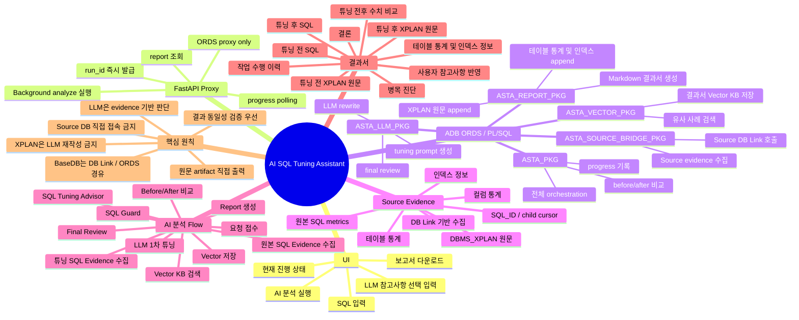

# ASTA AI SQL Tuning Assistant Mindmap

아래 Mermaid mindmap은 ASTA 프로그램의 주요 구성요소와 처리 흐름을 간단히 표현한 것입니다.

## 보기 방법

VS Code에서는 Mermaid preview 확장을 설치한 뒤 Markdown preview로 보면 됩니다.

GitHub나 Mermaid 지원 문서 도구에서는 이 파일을 그대로 열면 mindmap으로 렌더링됩니다.

## 수정 팁

- 큰 덩어리는 최상위 노드로 유지합니다.
- 상세 구현 함수명은 필요한 경우에만 하위 노드로 추가합니다.
- 발표용으로는 `Source Evidence`, `AI 분석 Flow`, `결과서` 3개 가지를 중심으로 설명하면 가장 이해하기 쉽습니다.
