# ASTA Technical Mindmap

ASTA AI SQL Tuning Assistant의 기술 상세 마인드맵입니다. UI, Python/FastAPI, ADB PL/SQL, Source DB PL/SQL, ORDS, 배포/테스트 스크립트가 어디서 어떤 역할을 하는지 파일/함수/프로시저 기준으로 정리했습니다.

```mermaid
mindmap
  root((ASTA AI SQL Tuning Assistant - Technical Map))
    Frontend Static Extension
      static/index.html
        extension script load
          static/js/extensions/tuning_assistant.js
          static/js/extensions/app_extensions.js
      static/js/extensions/app_extensions.js
        window.AppExtensions.routes
          tuning route 등록
          menu item 삽입
      static/js/extensions/tuning_assistant.js
        window.Views.tuningAssistant
          ASTA 화면 렌더링
          SQL editor
          LLM 참고사항 textarea
          AI 분석 실행 button
          현재 진행 compact badge
          보고서 다운로드
        DEFAULT_STEPS
          1 REQUEST_RECEIVED
          2 ORDS_DISPATCH
          3 SQL_GUARD
          4 BEFORE_EVIDENCE
          5 SQL_TUNING_ADVISOR
          6 VECTOR_KB
          7 LLM_REWRITE
          8 AFTER_EVIDENCE
          9 LLM_FINAL_REVIEW
          10 FINAL_REPORT
          11 VECTOR_SAVE
        formatSql(sql)
          UI SQL formatting
        buildAnalyzeUrl(input)
          analyze endpoint normalize
        buildBaseUrl(input)
          runs/progress/report base URL
        fetchJson(url, options)
          HTTP JSON wrapper
          ORDS NOT_FOUND body 처리
        pollRunProgress(baseUrl, runId)
          runs/run_id/progress polling
          40분 maxAttempts
          완료 시 fetchReport
        renderProgressStack(target, progress)
          현재 단계 하나만 표시
          전체 COMPLETED면 완료만 표시
          중간 SQLTUNE_ERROR는 상단 숨김
        renderResult(target, data)
          detailed_report_markdown 표시
          download state 저장
        downloadText(filename, text)
          Markdown 결과서 다운로드
    Python / FastAPI Layer
      app/main.py
        FastAPI app 생성
        router include
        static files serving
      app/routers/asta_proxy.py
        router /api/asta
        analyze(request, BackgroundTasks)
          proxy run_id 즉시 생성
          UI에 RUNNING 즉시 반환
          ORDS analyze background task 등록
          payload에 run_id 주입
        _run_ords_analyze_background
          ORDS /analyze 호출
          완료 결과 async run state에 저장
          audit event 기록
        get_run_progress(run_id)
          ADB ORDS progress 우선 조회
          ADB row 없으면 proxy local placeholder
          완료 후 final snapshot 반환
        get_run_report(run_id)
          ADB ORDS report 조회
          async final result fallback
        get_run(run_id)
          full run JSON 조회
        list_profiles
          ASTA profile 목록 proxy
        _post_json_to_ords
          urllib 기반 ORDS POST
          timeout_seconds 적용
        _get_json_from_ords
          ORDS GET wrapper
        _new_proxy_run_id
          OADT2-ASTA UUID 생성
        _initial_async_progress
          proxy local 11단계 placeholder
      app/asta_audit.py
        new_request_id
          audit request id 생성
        write_event
          JSONL audit 기록
        write_run_snapshot
          local final run snapshot 저장
        read_run_snapshot
          fallback report/progress 조회
        result_fields
          response summary 추출
      app/deps.py
        current_db
        get config dependency
      app/config.py
        AppConfig
        DatabaseConfig
        asta.ords_base_url
        asta.analyze_path
        asta.timeout_seconds
      app/asta_source_direct.py
        legacy / fallback source-direct utilities
        현재 ASTA main path에서는 직접 Source DB 접속 금지
      Python이 쓰이는 곳
        FastAPI same-origin proxy
        async job orchestration
        audit/snapshot 저장
        deployment scripts
        test/smoke scripts
        DB 직접 tuning 로직은 Python이 아니라 ADB PL/SQL에서 수행
    ORDS Layer
      db/ords/asta_ords_module.sql
        ORDS module asta.v1 설치
        POST /analyze
          asta_pkg.analyze_sql(:body_text)
        GET /runs/:run_id
          asta_pkg.get_run
        GET /runs/:run_id/progress
          asta_pkg.get_progress
        GET /runs/:run_id/report
          asta_pkg.get_report
        GET /profiles
          asta_pkg.list_profiles
      runtime endpoint
        https://.../ords/admin/asta/analyze
        FastAPI proxy endpoint
          /api/asta/analyze
    ADB Repository Tables
      db/asta/001_asta_repository.sql
        ASTA_RUNS
          run_id
          status
          input_sql
          tuned_sql
          detailed_report_md
          response_json
          timestamps
        ASTA_RUN_PROGRESS
          run_id + seq
          code
          label
          status
          detail
          elapsed_ms
      db/asta/002_asta_source_connections.sql
        ASTA_SOURCE_CONNECTIONS
          source_db_id
          db_link_name
          source_schema
          enabled_yn
      db/asta/004_asta_vector_tables.sql
        ASTA_TUNING_CASES
          case/report metadata
        ASTA_TUNING_CASE_CHUNKS
          chunked report text
    ADB Main Orchestration
      db/adb/asta_pkg.sql
        package asta_pkg
        analyze_sql(p_body_json)
          main workflow entry
          parse payload
            sql/sql_text
            run_id/client_run_id
            llm_profile
            source_db_id
            use_llm
            run_advisor/use_sqltune
            tuning_context
          normalize_run_id
            proxy run_id 수용
          ASTA_RUNS insert RUNNING
            early COMMIT
            progress polling 가능하게 함
          record_progress seq1 REQUEST_RECEIVED
          SQL_GUARD
            asta_sql_guard_pkg.assert_safe_select
          BEFORE_EVIDENCE
            asta_source_bridge_pkg.get_connection_json
            asta_source_bridge_pkg.run_source_evidence
          SQL_TUNING_ADVISOR
            source evidence advisor status 반영
          VECTOR_KB
            asta_vector_pkg.search_similar_cases
          LLM_REWRITE
            asta_llm_pkg.generate_tuning
          AFTER_EVIDENCE
            tuned SQL run_source_evidence
            invalid candidate fallback
          build_comparison_json
            before/after row_count
            output_rows_match
            buffer_gets_delta
            elapsed_time_delta
          LLM_FINAL_REVIEW
            asta_llm_pkg.final_review
          FINAL_REPORT
            asta_report_pkg.build_report
          VECTOR_SAVE
            asta_vector_pkg.save_case
          build_response_json
            asta_report_pkg.build_response_json
          ASTA_RUNS update COMPLETED/FAILED
        record_progress
          autonomous transaction
          RUNNING insert/update
          DONE/FAILED/SKIPPED completion
        build_progress_array_json
          11단계 progress JSON 생성
        get_progress(run_id)
          ASTA_RUNS + ASTA_RUN_PROGRESS 조회
        get_run(run_id)
          response_json 반환
        get_report(run_id)
          detailed_report_md 반환
        list_profiles
          user_cloud_ai_profiles에서 ASTA profile 조회
    ADB SQL Guard
      db/adb/asta_sql_guard_pkg.sql
        package asta_sql_guard_pkg
        assert_safe_select(p_sql)
          SELECT/WITH 단일문만 허용
          DML/DDL/PLSQL 차단
          semicolon/slash terminator 차단
        extract_candidate_sql(p_llm_text)
          LLM response에서 candidate_sql 추출
          markdown/jsonish recovery
          safe select 검증
        inspect_sql(p_sql)
          guard result JSON 반환
        strip_leading_comments
        scrub_guard_text
    ADB Source Bridge
      db/adb/asta_source_bridge_pkg.sql
        package asta_source_bridge_pkg
        get_connection_json(source_db_id)
          ASTA_SOURCE_CONNECTIONS 조회
          DB Link/schema 반환
        run_source_evidence
          DB Link로 Source package 호출
          source_db_id
          sql
          run_id
          fetch_rows
          repeat_policy
          run_advisor
          sqltune_time_sec
        execution boundary
          ADB에서 Source DB 직접 runtime 접속 금지
          DB Link + Source helper만 사용
    Source DB Evidence Package
      db/source/asta_source_pkg.sql
        package asta_source_pkg
        run_evidence
          Source DB에서 실제 SQL evidence 수집
          SQL 실행
          row_count/output sample
          v$sql metrics
          SQL_ID/child cursor
          DBMS_XPLAN.DISPLAY_CURSOR
          object_info 수집
          optional SQL Tuning Advisor
        collect_object_info
          execution plan object 기준 table stats
          column stats
          index stats
          index columns
        DBMS_XPLAN
          plan_text 생성
          report에 원문 append됨
        SQLTUNE
          restricted login이면 FAILED/actionable message
          direct Source DB fallback 없음
    ADB LLM Package
      db/adb/asta_llm_pkg.sql
        package asta_llm_pkg
        build_tuning_prompt
          input SQL full CLOB
          compact_source_evidence
          compact_vector_evidence
          tuning_context.user_notes
          object_info_excerpt
          safe SELECT instruction
        compact_source_evidence
          row_count
          buffer_gets
          disk_reads
          elapsed
          advisor status
          xplan excerpt
          object_info excerpt
        generate_tuning
          DBMS_CLOUD_AI.GENERATE action chat
          ASTA profile
          JSON_ONLY response
          candidate_sql extraction
          tuning_context artifact 보존
        compact_before_after
          comparison metrics
          candidate SQL excerpt
          user_notes
          XPLAN policy
        final_review
          before/after evidence로 최종 결과서 LLM 작성
          report_markdown JSON 반환
          raw XPLAN 재작성 금지
    ADB Report Package
      db/adb/asta_report_pkg.sql
        package asta_report_pkg
        build_report
          final_review report 우선 사용
          fallback deterministic report 생성
          user context section 보정
          XPLAN 원문 append
          object metadata append
        final_review_report_markdown
          final_review JSON에서 report_markdown 추출
          JSON-ish recovery
          malformed/duplicated heading guard
        enforce_user_context_section
          LLM이 참고사항 없음이라고 잘못 쓰면 보정
          tuning_context.user_notes 직접 출력
        append_xplan_raw_sections
          튜닝 전 XPLAN 원문
          튜닝 후 XPLAN 원문
          plan_text artifact에서 직접 출력
        append_object_metadata_section
          table_stats
          columns
          indexes
          결과서 하단 표 출력
        append_tuning_result_front
          결론/추천/수치 요약 전면 배치
        append_stage_check
          11-stage execution history 생성
          API artifact/report 내부용
        append_evidence_summary
          fallback report evidence + XPLAN
        build_response_json
          API response JSON 생성
          detailed_report_markdown
          runtime_evidence
          after_evidence
          comparison
          artifacts.llm
          artifacts.final_review
    ADB Vector Package
      db/adb/asta_vector_pkg.sql
        package asta_vector_pkg
        search_similar_cases
          SQL fingerprint 기반 유사 사례 검색
          top_k 반환
        save_case
          run_id/report 저장
          ASTA_TUNING_CASES
          ASTA_TUNING_CASE_CHUNKS
        chunk_clob
          report chunk 저장
        sql_fingerprint
          normalized hash
    Deployment / Python Scripts
      tools/asta_deploy_adb.py
        ADB schema objects compile
        repository tables ensure
        ASTA_SOURCE_CONNECTIONS upsert
        ORDS module install
        object VALID 확인
      tools/asta_deploy_source.py
        Source DB package compile
        source helper install
      tools/asta_smoke_adb.py
        ADB ORDS smoke test
      tools/asta_report_summary_format_smoke.py
        report format smoke
      tools/run_asta_10_sqls.py
        sample 10 SQL batch run
        reports/asta_10sql_bg_latest 생성
      scripts/source_runtime_xplan.py
        source runtime XPLAN 조사용 script
    Tests / Contracts
      tests/test_tuning_assistant_static.py
        extension loading
        UI labels/buttons
        progress compact display
        timeout behavior
        sample SQL
      tests/test_asta_ords_proxy.py
        FastAPI proxy analyze async
        run_id propagation
        ORDS URL normalization
        audit behavior
      tests/test_asta_adb_ords_static_contracts.py
        PL/SQL contract static checks
        report format
        progress stages
        object_info
        XPLAN raw append
      tests/test_asta_ords_migration_contract.py
        ORDS/ADB migration boundary
      tests/test_asta_proxy.py
        legacy proxy tests
    Runtime Data Flow
      1 UI
        user enters SQL
        optional LLM notes
        clicks AI 분석 실행
      2 FastAPI Proxy
        creates run_id
        returns RUNNING immediately
        background calls ORDS /analyze
      3 ORDS
        POST body to asta_pkg.analyze_sql
      4 ADB ASTA_PKG
        records progress
        validates SQL
        calls Source Bridge
      5 Source DB
        executes evidence SQL
        gathers metrics/XPLAN/object stats
      6 ADB LLM
        vector search
        DBMS_CLOUD_AI rewrite
        tuned SQL evidence
        before/after comparison
        final review
      7 Report
        Markdown result
        raw XPLAN direct append
        table/index stats append
        response JSON saved
      8 UI
        polls progress
        shows current stage only
        fetches final report
        report download
    Security / Boundary Rules
      Source DB direct connection prohibited
      FastAPI is ORDS proxy only
      ADB calls Source via DB Link helper
      SQL Guard allows SELECT/WITH only
      no DDL/DML/PLSQL candidate execution
      LLM cannot invent metrics
      XPLAN raw output from artifact not LLM
      evidence/result equivalence wins over user notes
```

## 빠른 설명용 요약

- UI는 `static/js/extensions/tuning_assistant.js`에 있고, 버튼/입력/progress/report download를 담당합니다.
- Python은 SQL 튜닝을 직접 하지 않습니다. `app/routers/asta_proxy.py`에서 same-origin proxy, async job, progress/report 조회, audit/snapshot을 담당합니다.
- 실제 튜닝 orchestration은 ADB의 `db/adb/asta_pkg.sql` `analyze_sql()`이 담당합니다.
- Source DB evidence는 ADB가 DB Link로 `db/source/asta_source_pkg.sql`을 호출해서 수집합니다.
- LLM 호출은 ADB 내부 `db/adb/asta_llm_pkg.sql`에서 `DBMS_CLOUD_AI.GENERATE`로 수행합니다.
- 결과서 생성은 `db/adb/asta_report_pkg.sql`이며, XPLAN 원문과 테이블/인덱스 통계는 LLM이 아니라 artifact에서 직접 붙입니다.
- 배포와 검증 자동화는 Python scripts(`tools/asta_deploy_adb.py`, `tools/asta_deploy_source.py`, `tools/run_asta_10_sqls.py`)가 담당합니다.

## 추천해서 같이 볼 파일

- UI: `static/js/extensions/tuning_assistant.js`
- Proxy: `app/routers/asta_proxy.py`
- Main workflow: `db/adb/asta_pkg.sql`
- LLM: `db/adb/asta_llm_pkg.sql`
- Report: `db/adb/asta_report_pkg.sql`
- Source evidence: `db/source/asta_source_pkg.sql`
- ORDS install: `db/ords/asta_ords_module.sql`
- ADB deploy: `tools/asta_deploy_adb.py`
